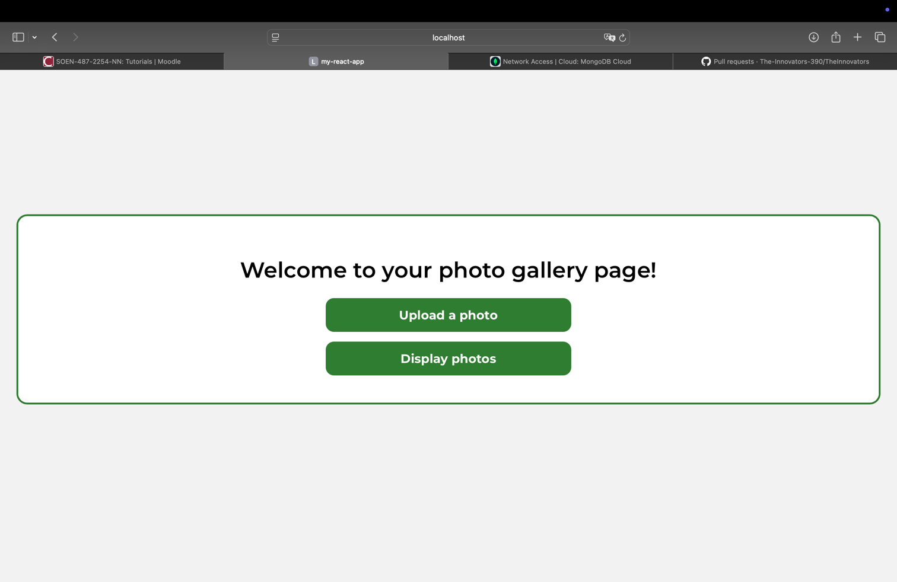
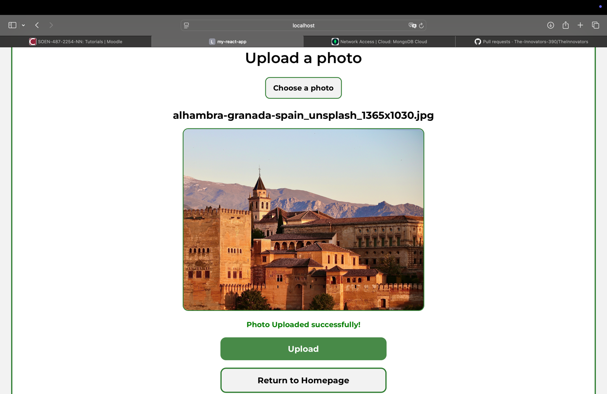
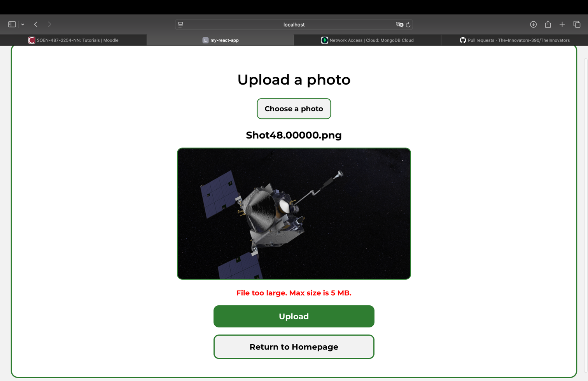
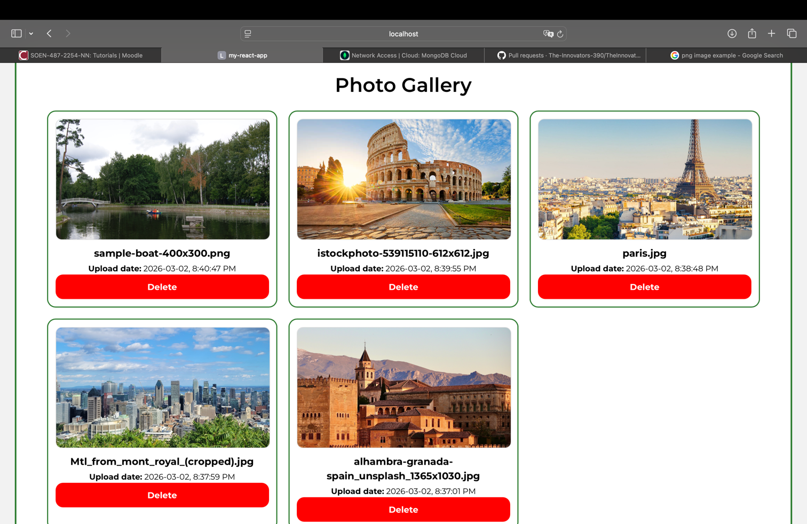
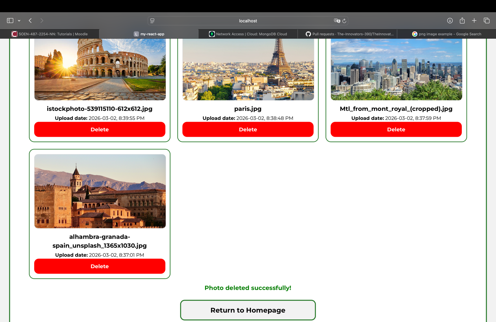

## SOEN487 - Web Services and Applications
### Name: Fouad Meida (40249310)
### Assignment 2


## Setup instructions: Follow these steps in order
- Verify npm and node are installed on your machine:
```
node -v
npm -v
```
- Install frontend dependencies:
```
cd frontend
npm install
npm i react-router-dom
```
- Install backend dependencies:
```
cd ../backend
npm install
```
## How to run the application
- In your current terminal, start the backend server:
```
node server.ts
```
The server will connect automatically to the MongoDB Atlas database, since it's already configured.
(the MongoDB Atlas is already set up to accept requests from different IP addresses)

You should see the following:
```
Connected to MongoDB Atlas
Server running on port 5000
```
- Open an additional terminal window, then start the frontend web application:
```
cd frontend
npm run dev
```
A link to the application will be displayed in your terminal
```
 http://localhost:5173
```
Click on the link, the application will open in your browser.

## Screenshots of working application

1) Homepage:


2) Upload a new image (success case):


3) Upload a new image (failure case):


4) Display photos:


5) Delete an image "sample-boat-400x300.png" (success case):
